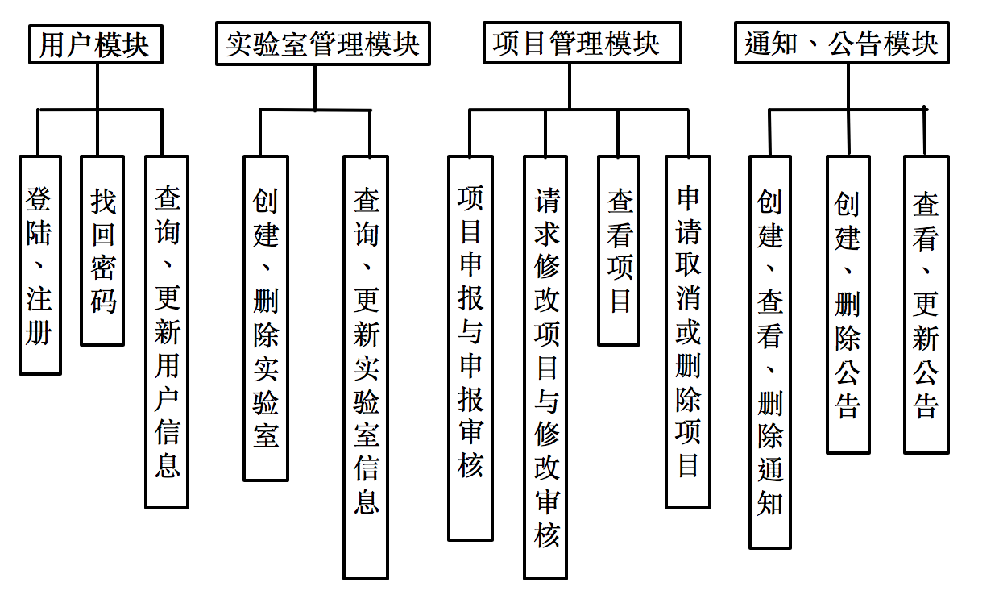
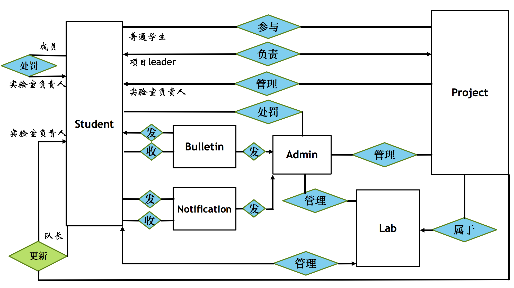

# PMS
Project Management System  
实验室项目管理系统  
SpringMVC + 前端基础框架(jQuery、Bootstrap等）
## 需求分析
1. 有两种用户 学生和管理员 管理员 可以增删改查实验室，任命一个学生作为实验室负责人（一对一），该负责人可以更新实验室；

2. 对于任何一名学生 都可以申请一个指定实验室的项目待审核，每一个项目包括一个队长和不超过6个队员。（一个学生同一时间只能管理一个活跃项目，可以参与多个项目）

3. 一个项目有7种进度状态：待审核，被拒绝，进行中，已完成，已取消，已超时，已删除，并列两种操作状态：请求修改中，请求check。每种进度状态下允许队长进行不同的操作，比如待审核状态队长可以撤回、修改；所有非活跃状态下队长可以提交删除，但是在管理员一端查看是未被删除；已超时状态会被实验室负责人或管理员处罚，在一定时间内不允许申请项目等等。

4. 实验室负责人可以直接查看、操作实验室项目，系统管理员拥有所有实验室、实验室负责人权限。队长可以请求项目有关操作，等待实验室负责人审核。队员只可以查看自己的项目。

5. 队长的每次请求都会发出通知，审核出结果会接收到通知。实验室负责人可以对成员发通知；管理员可以发布公告。

## 系统功能模块
一、用户模块

二、项目管理模块

三、实验室管理模块

四、通知和公告

## UML

## 表设计
```sql
create table admin
(
    id             int(11) unsigned   auto_incrementprimarykey,
     password varchar(255)         not null

) engine=InnoDB DEFAULT CHARSET=utf8;

create table student
(
    id  char(12)  not null  primary key,
    name  varchar(20)  notnull,
    password  varchar(255)   notnull,
    email  varchar(30)  notnull,
    phone  varchar(11)   default '’  null,
    grade  smallint(6)  null,
    college  varchar(20)  default''    null,
    major  varchar(20)  default '’  null,
    introduce  varchar(1000)  default '’  null,
    punish_end  timestamp  null,


    constraintstudent_email_uindex  unique (email)

) engine=InnoDB DEFAULT CHARSET=utf8;

create table laboratory
(
   id  int(11) unsigned  auto_increment  primary key,
    name  varchar(20)               not null,
     classroom     varchar(20)               not null,
    description  varchar(5000) default'’  null,
    leader_id    char(12)                    null,

  create_timetimestamp default now()not null,
    constraintlaboratory_name_uindexunique (name),

    constraint laboratory_student_id_fkunique (leader_id),

    constraint laboratory_student_id_fkforeign key (leader_id) 

  referencesstudent (id) on updatecascade on delete set null

)engine=InnoDBDEFAULT CHARSET=utf8;

create table project(
    id            int(11) unsigned   auto_increment  primary key,
    name          varchar(20)                        not null,
    description  varchar(255) default ''            null,
    start_time    timestamp                          null,
    end_time      timestamp                          null,
    duration      intunsigned default '2592000’  not null,
    submit_timetimestamp                          not null,
    coach_id      varchar(20) default ''             null,
    opt_status    smallint(5) unsigned default '0'   not null,
    lab_name      varchar(20)                             not null,
    leader_id     char(12)                           not null,
    aim           varchar(2000)                      not null,
    type          varchar(20) default '普通项目'             null,
    deleted       int(1) default '0'                 not null,
     constraint project_laboratory_name_fk

 foreign key (lab_name) references laboratory (name)

   on update cascade

   on delete cascade,

 constraint project_student_id_fk

 foreign key (leader_id) references student (id)

   on update cascade

   on delete set null)engine=InnoDBDEFAULT CHARSET=utf8;
   
create table participate
(
  id   int(11) unsigned   auto_increment   primary key,
  pidint(11) unsigned   not null,
  sidchar(12)           notnull,


  constraint participate_ibfk_1
  foreign key (pid) references project (id)
    on update cascade  on delete cascade,


  constraint participate_ibfk_2
  foreign key (sid) references student (id)
    on update cascade  on delete cascade
) engine=InnoDBDEFAULT CHARSET=utf8; 
create index pid

 on participate (pid);

create index sid

 on participate (sid);


create table modification

(

 id          int(11) unsigned auto_increment

   primary key,

  pid         int(11) unsigned                 notnull,

  name        varchar(20)                      notnull,

 description varchar(255) default ''          null,

 duration    intunsigned default '2592000'   not null,

  coach_id   varchar(20) default''           null,

  opt_status  smallint(5) unsigned default '0' not null,

  leader_id  char(12)                         null,

  aim         varchar(2000)                    notnull,

  type        varchar(20) default''           null,

  members    varchar(127)                     notnull,

 constraint modification_project_id_fk

 foreign key (pid) references project (id)

   on update cascade

   on delete cascade,

 constraint modification_student_id_fk

 foreign key (leader_id) references student (id)

   on update cascade

   on delete set null

)engine=InnoDBDEFAULT CHARSET=utf8; 


create table participate
(
  id   int(11) unsigned   auto_increment   primary key,
  pidint(11) unsigned   not null,
  sidchar(12)           notnull,


  constraint participate_ibfk_1
  foreign key (pid) references project (id)
    on update cascade  on delete cascade,


  constraint participate_ibfk_2
  foreign key (sid) references student (id)
    on update cascade  on delete cascade
) engine=InnoDBDEFAULT CHARSET=utf8; 
create index pid

 on participate (pid);

create index sid

 on participate (sid);


create table notification

(

 id      int(11) unsigned auto_increment

   primary key,

  type   varchar(20) default'系统通知'          notnull,

  contentvarchar(140)                        notnull,

  `from` varchar(20) default'系统通知'          null,

 time    timestamp default CURRENT_TIMESTAMP not null

)

engine=InnoDBDEFAULT CHARSET=utf8; 


create table modification

(

 id          int(11) unsigned auto_increment

   primary key,

  pid         int(11) unsigned                 notnull,

  name        varchar(20)                      notnull,

 description varchar(255) default ''          null,

 duration    intunsigned default '2592000'   not null,

  coach_id   varchar(20) default''           null,

  opt_status  smallint(5) unsigned default '0' not null,

  leader_id  char(12)                         null,

  aim         varchar(2000)                    notnull,

  type        varchar(20) default''           null,

  members    varchar(127)                     notnull,

 constraint modification_project_id_fk

 foreign key (pid) references project (id)

   on update cascade

   on delete cascade,

 constraint modification_student_id_fk

 foreign key (leader_id) references student (id)

   on update cascade

   on delete set null

)engine=InnoDBDEFAULT CHARSET=utf8; 


create table notify

(

 id  int(11) unsigned auto_increment

   primary key,

  nidint(11) unsigned not null,

  sidchar(12)         not null,

  constraintnotify_notification_id_fk

  foreignkey(nid) referencesnotification(id)

    on update cascade

    on deletecascade,

  constraintnotify_student_id_fk

  foreignkey(sid) referencesstudent(id)

    on update cascade

    on deletecascade

)engine=InnoDBDEFAULT CHARSET=utf8; 


create table bulletin

(

 id         int(11) unsigned auto_increment

   primary key,

 time       timestamp default CURRENT_TIMESTAMP not null,

  title      varchar(30) default''              notnull,

  content   varchar(20000) default''           notnull,

  `from`     varchar(20) default'系统通知'          null,

  read_countint(11) unsigned default '0'        not null

)
```
